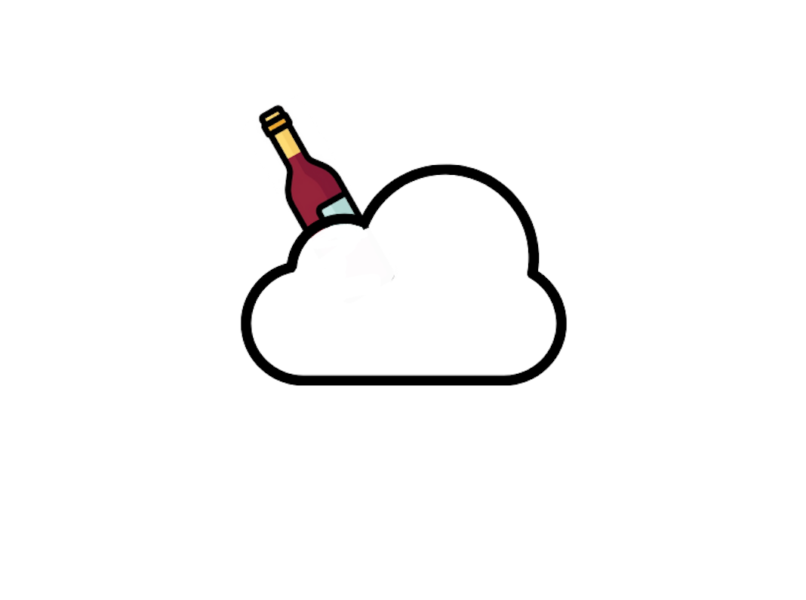

  

Born at Le Wagon Paris (#885) as part of the final project and motivated by this [poster](https://shop.winefolly.com/products/how-to-choose-wine?_gl=1%2A1ikmdky%2A_ga%2AMTQ5MjQ1MjEwNi4xNzIwMzgxMjY3[...]

# Context 

Picking a wine bottle is not always an easy exercise : mostly because some of us have limited knowledge about wine and the other reason may be the way too large number of options that we are given [...]

While these conventional methods are handy, we think that they miss out on one key variable, that is the social context in which a wine bottle is opened. In our daily life, picking a wine bottle d[...]

Matching the characteristics of wine (such as acidity, body, length) with a specific context is challenging : on one hand, there is no clear evidence that matching wine with an occasion provides a[...]

# Framework
Our model takes an occasion (i.e a description) as an input to generate a wine recommendation as an output.

An old version of the model (wineteller v0) is available [here](https://github.com/chyunoo/wineteller/tree/master/wineteller). It leveraged a survey results where participants were asked to assess[...]

Our second model (wineteller v1), which is currently deployed [🚀,](https://wineteller.streamlit.app/) is inspired by [Roald Schuring's model](https://towardsdatascience.com/robosomm-chapter-5-f[...]

The current model is not exempt of limitations. One can argue that the choice of words defining each occasion is biased as not all wines with flower notes are suitable for a romantic occasion, tha[...]

Both of wineteller v0 and v1 are static models, that can not be fine-tuned through training. This mostly stems from the lack of a way to evaluate the performance of our model. However, we plan to [...]

# Current features
* **🥂 Occasion-wine pairing** : describe your occasion (romantic, moody, casual, fancy) and get wine recommendations
* **📊 Wine recommendation visualization** : view your wine recommendation's profile
* **🤖 Sommelier justification widget** : learn more about how your wine recommendation was made 

# Roadmap
* Allow language switch, 🇫🇷 in particular (user request)
* Allow to re-shuffle wine recommendations
* Allow to select region, wine style
* Allow to explore full wine dataset (by chunks)
* Create a performance metric